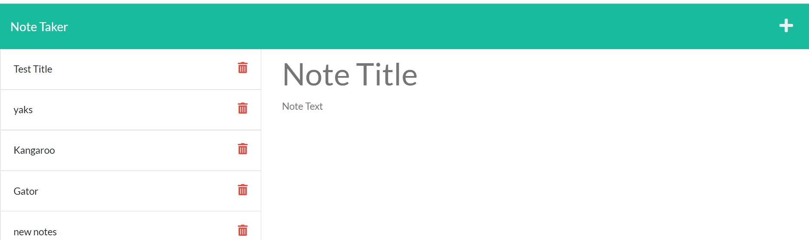

# Note Taker 

## Description
This is a note taking app that lets the user add, save, load, and delete notes. 

## Built with
-  HTML
-  CSS
-  Javascript
-  Node
-  Express.js

## Website
Deployed using Heroku at: https://blooming-springs-91895.herokuapp.com/

## Usage

The intented user is someone needed a virtual tool for tracking to-do items or other notes.  To use the app go to the provided website, click on the Get Started button, enter a new note in the provided form, click the save icon in the navigation bar.  To retrieve a saved note, click on the title.  To delete a note, click on the delete icon. 

## Contribution

-  Database and routes created by Angela Gustafson (angiebunk1)
-  Starter code provided by Xander Rapstine (Xandromus) and John McCambridge (nol166)